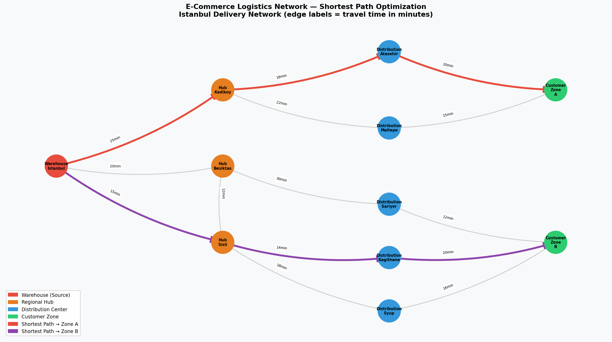

# E-Commerce Logistics Network Optimization

## 1. Real-World Problem Context

Istanbul is one of Europe's largest e-commerce markets. A fast-growing online retailer operating in Istanbul faces a critical operational challenge: orders placed before noon must be delivered to customers within the same day. The company runs a central warehouse and relies on a network of regional hubs and local distribution centers spread across the city. Without a systematic routing strategy, delivery trucks take suboptimal paths, wasting time and fuel.

This project models the company's logistics infrastructure as a directed network and applies the **Shortest Path algorithm** to determine the fastest delivery route from the central warehouse to two customer delivery zones.

---

## 2. Problem Definition

**Decision Problem:** What is the minimum-time route from the central warehouse (`Warehouse_Istanbul`) to each customer delivery zone (`Customer_Zone_A`, `Customer_Zone_B`)?

**Objective:** Minimize total travel time (in minutes) across the delivery network.

**Constraints:**
- Deliveries must flow in one direction: Warehouse → Hub → Distribution Center → Customer Zone
- Each link has a fixed travel time, distance, and cost attribute
- At least one path must exist between the warehouse and every customer zone

---

## 3. Network Model

The logistics network is modeled as a **Weighted Directed Graph (DiGraph)**:

- **Nodes** represent physical locations: the central warehouse, regional hubs, distribution centers, and customer delivery zones.
- **Edges** represent direct road connections between these locations.
- **Edge weights** capture three operational metrics: travel time (minutes), distance (km), and cost (USD).

The primary optimization weight used is `travel_time_min`, as same-day delivery speed is the key competitive metric.

---

## 4. Nodes and Edges

### Nodes (11 total)

| Node | Type | Description |
|------|------|-------------|
| Warehouse_Istanbul | Source | Central warehouse, order fulfillment origin |
| Hub_Kadikoy | Hub | Regional relay hub — Asian side |
| Hub_Besiktas | Hub | Regional relay hub — European waterfront |
| Hub_Sisli | Hub | Regional relay hub — Central European side |
| Distribution_Atasehir | Distribution Center | Last-mile entry point, east |
| Distribution_Maltepe | Distribution Center | Last-mile entry point, south |
| Distribution_Sariyer | Distribution Center | Last-mile entry point, north |
| Distribution_Kagithane | Distribution Center | Last-mile entry point, central-north |
| Distribution_Eyup | Distribution Center | Last-mile entry point, northwest |
| Customer_Zone_A | Destination | Delivery zone covering eastern districts |
| Customer_Zone_B | Destination | Delivery zone covering northern districts |

### Edges (14 total)

| From | To | Time (min) | Distance (km) | Cost ($) |
|------|----|-----------|--------------|---------|
| Warehouse_Istanbul | Hub_Kadikoy | 25 | 18 | 12 |
| Warehouse_Istanbul | Hub_Besiktas | 20 | 14 | 9 |
| Warehouse_Istanbul | Hub_Sisli | 15 | 10 | 7 |
| Hub_Kadikoy | Distribution_Atasehir | 18 | 12 | 8 |
| Hub_Kadikoy | Distribution_Maltepe | 22 | 16 | 10 |
| Hub_Besiktas | Hub_Sisli | 12 | 8 | 5 |
| Hub_Besiktas | Distribution_Sariyer | 30 | 22 | 14 |
| Hub_Sisli | Distribution_Kagithane | 14 | 9 | 6 |
| Hub_Sisli | Distribution_Eyup | 18 | 13 | 8 |
| Distribution_Atasehir | Customer_Zone_A | 10 | 6 | 4 |
| Distribution_Maltepe | Customer_Zone_A | 15 | 10 | 6 |
| Distribution_Sariyer | Customer_Zone_B | 12 | 7 | 5 |
| Distribution_Kagithane | Customer_Zone_B | 20 | 14 | 9 |
| Distribution_Eyup | Customer_Zone_B | 16 | 11 | 7 |

---

## 5. Selected Algorithm

**Algorithm:** Dijkstra's Shortest Path Algorithm  
**Library:** NetworkX (`nx.shortest_path` with `weight="travel_time_min"`)

Dijkstra's algorithm works by iteratively selecting the unvisited node with the smallest known distance from the source and updating the distances of its neighbors. It guarantees the optimal (minimum-weight) path in graphs with non-negative edge weights — which applies here since all travel times are positive.

This algorithm is widely used in real-world logistics and GPS navigation systems, making it highly appropriate for this MIS context.

---

## 6. Python Implementation

The solution is implemented in `src/solution.py` and consists of five steps:

1. **Load data** — reads `data/network_data.csv` using pandas
2. **Build graph** — constructs a directed weighted graph using NetworkX
3. **Run algorithm** — applies Dijkstra's algorithm for each target customer zone
4. **Visualize** — draws the full network and highlights optimal paths using matplotlib
5. **Save output** — writes results to `results/solution_output.txt`

Key libraries: `networkx`, `pandas`, `matplotlib`

---

## 7. Results

| Destination | Optimal Route | Travel Time | Distance | Cost |
|------------|--------------|-------------|----------|------|
| Customer_Zone_A | Warehouse → Hub_Kadikoy → Distribution_Atasehir → Zone_A | **53 min** | 36 km | $24 |
| Customer_Zone_B | Warehouse → Hub_Sisli → Distribution_Kagithane → Zone_B | **49 min** | 33 km | $22 |

---

## 8. Managerial Interpretation

The shortest path analysis provides two key operational insights:

**1. Hub_Sisli is the most strategically valuable node.** It sits on the fastest path to Customer_Zone_B and also serves as a shortcut connector from Hub_Besiktas. Any congestion or downtime at this hub would significantly increase delivery times to northern districts. Management should ensure redundant capacity and priority traffic agreements at this location.

**2. The Kadikoy corridor is the exclusive gateway to Zone A.** There is no alternative path to Customer_Zone_A that bypasses Hub_Kadikoy. This represents a single point of failure in the eastern delivery network. The company should consider establishing a direct Warehouse → Distribution_Atasehir link to de-risk this dependency, especially during peak traffic hours on the Bosphorus bridge routes.

**Overall:** Both zones can be reached within under one hour (49–53 minutes), which is achievable for same-day delivery commitments. Maintaining the performance of the Sisli and Kadikoy hubs should be a top operational priority.

---

## 9. How to Run the Code

### Prerequisites

### Run the solution
This will:
- Print the network data and shortest path results to the console
- Save `results/network_visualization.png`
- Save `results/solution_output.txt`

---

## 10. References

- Dijkstra, E. W. (1959). A note on two problems in connexion with graphs. *Numerische Mathematik*, 1(1), 269–271.
- NetworkX Documentation: https://networkx.org/documentation/stable/
- Chopra, S., & Meindl, P. (2016). *Supply Chain Management: Strategy, Planning, and Operation* (6th ed.). Pearson.
- Turban, E., Volonino, L., & Wood, G. (2015). *Information Technology for Management*. Wiley.

